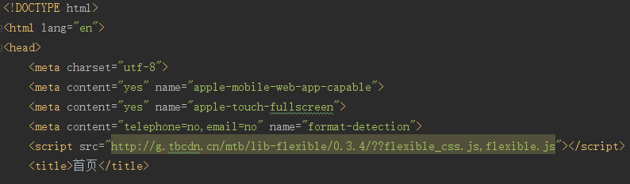
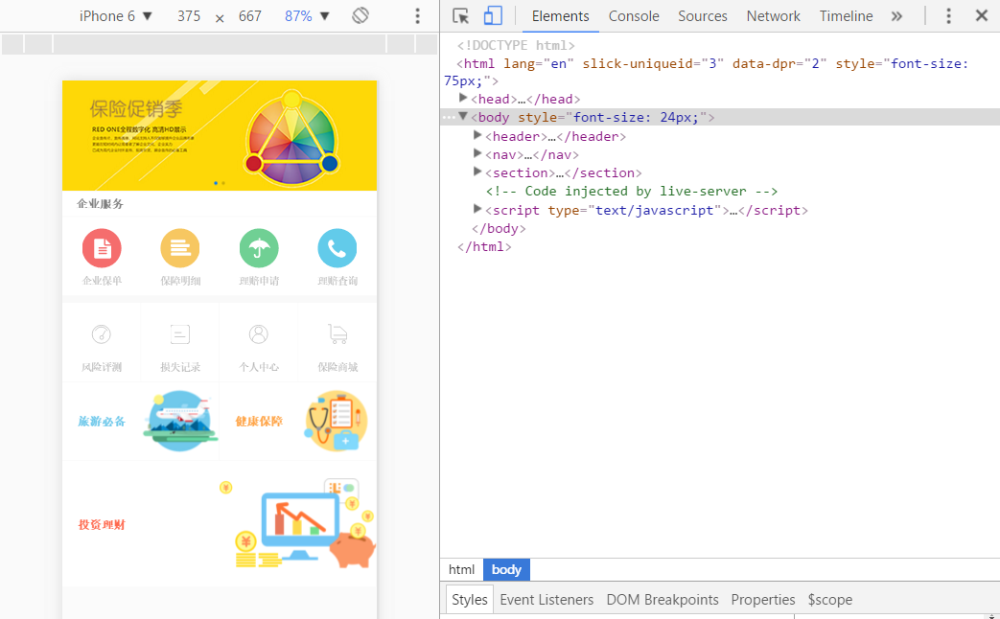
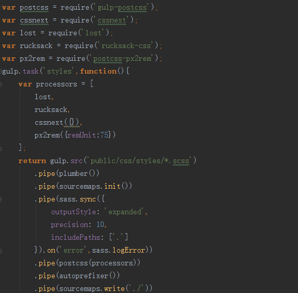
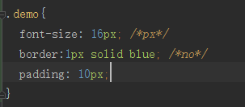
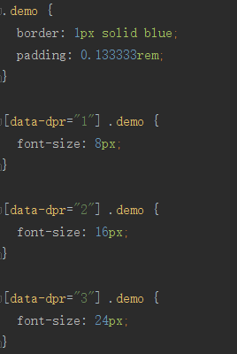
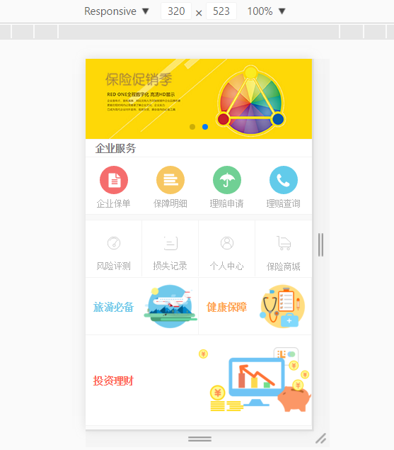

>The less you reveal the more people can wonder.

一次偶然的机会在某技术群里听到手淘flexible.js能够解决移动端适配的问题，遂实践了一下。想来用这套方案也有一段时间了，今天就将自己的理解和实践做个总结。

## 页面效果

首先放一张设计完成的页面效果图：


就是这样一个简单的H5页面，虽然H5页面相对于PC端Web页面简单了很多，但是难点在于让页面适配众多不同的终端设备。而终端设备有哪些，详细参考[Device metrics](https://design.google.com/devices/)，看完之后会感觉很恶心，但仍想完美的解决，这时牛X的手淘团队总结了一套[Flexible解决方案](https://github.com/amfe/lib-flexible)

## 手淘的方案

#### 1. 直接上图看看手淘的适配协作模式：


对这张图我的理解让UI在750px设计并标注大小和坐标，再矢量放大1.5倍后切图，于是我得到了所谓的@3x切图


#### 2. 引入flexible.js

[lib-flexible库](https://github.com/amfe/lib-flexible)使用方法非常简单，只需要在head头标签中添加对应的flexible_css.js,flexible.js文件。

第一种方法是将文件下载到你的项目中，然后引入添加：

```javascript
<script src="./js/lib/flexible_css.debug.js"></script>
<script src="./js/lib/flexible.debug.js"></script>
```

或者直接加载阿里CDN的文件：

```javascript
<script src="http://g.tbcdn.cn/mtb/lib-flexible/{{version}}/??flexible_css.js,flexible.js"></script>
```

将代码中的***{{version}}***换成对应的版本号0.3.4.


注意使用lib-flexible，通常不要写：
```javascript
<meta name="viewport" content="width=device-width,minimum-scale=1.0,maximum-scale=1.0,user-scalable=no"/>
```
交给flexible.js自己处理。

我们来看看效果，在chrome中选择iphone6可以看到font-size:75px：


#### 3. 把视觉搞中的px转换成rem

什么是rem？
>font size of the root element.

当html中font-size能够动态给出，这样使用rem就十分简单了。而如何将750px下的标注搞转换成rem。这里简单的介绍下Flexible的做法。

目前Flexible会将视觉稿分成100份（主要为了以后能更好的兼容vh和vw），而每一份被称为一个单位a。同时1rem单位被认定为10a。针对我们这份视觉稿可以计算出：

```
1a   = 7.5px
1rem = 75px 
```

所以显而易见，只要将750px下的标注搞/75就是对应的rem的值，比如视觉稿中的图片大小为200px*200px，转换成为2.667rem*2.667rem。

## 如何快速计算CSS

关于这方面的工具有很多，手淘同学编写了各种工具，这里我使用的[PostCSS(px2rem)](https://www.npmjs.com/package/px2rem)，非常好用，在此谢过。gulpfile.js文件的编写如下：



配置完成后实际用的时候只要这样使用：



px2rem处理之后将会变成：



另外如果你是使用Sass或是Less，你也可以使用Sass函数、混合宏来实现：

```javascript
@function px2em($px, $base-font-size: 16px) {
    @if (unitless($px)) {
        @warn "#{$px} 参数应该为像素";
        @return px2em($px + 0px);
    } @else if (unit($px) == em) {
        @return $px;
    }
    @return ($px / $base-font-size) * 1em;
}
```

***需要注意的是字号不使用rem，还是用px***

## 效果

最后，直接看下效果吧。
Mobile S


Mobile L


## 总结

竟然写了这么长，这篇一来是对自己使用flexible的总结和感悟，总之用了之后很方便。其次也是最近有朋友问我是如何解决移动端适配，我直接说了flexible并扔了几个资料，把自己如何用的写出来估计会更好。有什么意见欢迎提出。